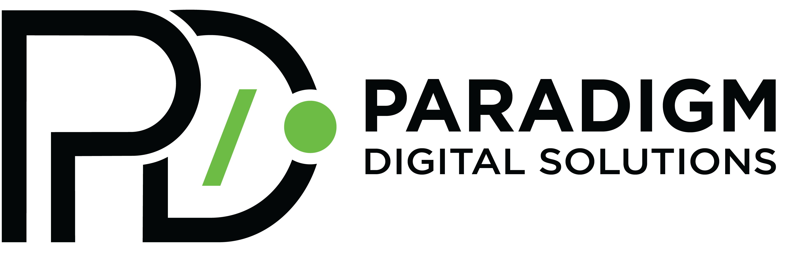

# Paradigm Project Tracker

<p align="center">
  
</p>

An internal CRM and project management mobile application built for **Paradigm Digital Solutions**. The app provides team members with a unified dashboard to manage customer pipelines, track communications logs, schedule follow-ups, and receive targeted task reminders in real-time.

---

## 🚀 Key Premium Features

* **Real-time Synchronization**: Client updates, activity log trails, and team edits are fully reactive, powered by a Firebase Firestore backbone.
* **Lag-Free Theme Engine**: Switch between high-contrast slate-dark mode and borderless clean light mode instantly. Custom fonts are cached locally to guarantee 0ms transition latency.
* **Targeted Alarms & Reminders**: Real-time foreground alarm checks wake up screens and launch glassmorphic overlays complete with actions to complete or snooze. Alarms trigger **strictly** for the team member assigned to the project.
* **Audio Alerts & Sound Mixer**: Plays native device looping alarm ringtones when reminder thresholds are reached. Features an inline sound mixer slider inside settings with audio-check preview chirps.
* **In-App Auto Update Checker**: Keeps the entire team on the latest software version automatically. Displays release notes and triggers browser downloads instantly.
* **Admin Version Control Dashboard**: Enables super admins to deploy new app version metadata straight to Firestore from the app UI.
* **Database-Driven Configurations**: Selector options, next action fields, and currency types update reactively from Firestore document modifications.

---

## 🗺️ App Flow & Screen Architecture

The application is structured linearly with a clean single-scaffold layout on the home screen to prevent memory leaks and transition lag:

```
[Login / Reset Password Screen] 
             │
             ▼ (Authentication Gate)
     [Home Screen Scaffold]
             │
     ┌───────┼───────┐
     ▼       ▼       ▼
[Dashboard] [Activity] [Settings]
     │               │
     │               ├─► [Edit Profile Screen]
     │               ├─► [Add Team Member Screen]
     │               └─► [Publish Update Modal]
     ▼
[Project Details Screen] 
     │
     └─► [Delete / Complete / Snooze Alerts]
```

* **AuthGate**: Inspects active firebase auth states. If logged out, directs to `LoginScreen`. If logged in, boots the `HomeScreen`.
* **HomeScreen**: Acts as the main scaffold holding the dynamic `BottomNav`. It also hosts the background timer checking for due alarms and version update events.
* **DashboardScreen**: Renders project cards, status metric chips, interactive search filters, and active team member selector filters.
* **SettingsScreen**: Hosts user profiles, theme toggles, alarm volume sliders, and super admin controls.

---

## 📦 Key Dependencies & Packages

| Package | Version | Purpose |
| :--- | :--- | :--- |
| `firebase_core` / `cloud_firestore` | `^3.1.0` | Powers the real-time database backbone and syncing. |
| `firebase_auth` | `^5.1.0` | Handles user authentication and secure logins. |
| `flutter_ringtone_player` | `^4.0.0` | Plays looping system alarms and sound check preview chirps. |
| `provider` | `^6.1.2` | Manages global states (theme switches, alarm volume settings). |
| `url_launcher` | `^6.3.0` | Opens GitHub release pages in the default system browser. |
| `google_fonts` | `^6.2.1` | Renders typography (Inter, Outfit) premium font styles. |

---

## 📝 STEP-BY-STEP: How to Publish an App Update (Reference Guide)

Follow these exact steps whenever you make changes and want to share a new build (e.g. `1.0.2`) with your team:

### Step 1: Update the Local Version Constants
1. Open the file [`assets/config/version_control.json`](file:///d:/studio_projects/paradigm_project_tracker/assets/config/version_control.json) and change `latestVersion` to the new version:
   ```json
   {
     "latestVersion": "1.0.2",
     "downloadUrl": "https://github.com/NirdeshanB/paradigm_project_tracker/releases",
     "features": [
       "Feature description line 1",
       "Feature description line 2"
     ],
     "isForceUpdate": false
   }
   ```
2. Open [`lib/theme/app_theme.dart`](file:///d:/studio_projects/paradigm_project_tracker/lib/theme/app_theme.dart) and update line 7 to match:
   ```dart
   static const String appVersion = '1.0.2';
   ```

### Step 2: Push Update to the Database (Firestore Sync)
1. Run the app locally on your computer in **Debug Mode** (e.g. run `flutter run` on your terminal or press Start in your IDE).
2. As soon as the app launches, it reads the local `version_control.json` file and automatically synchronizes the new metadata (version `1.0.2`, download URL, features) straight into your Firestore `/config/appVersion` database. 
3. *Note: You will see a debug log confirming the sync: `Sync Alert: Local version_control.json synchronized to Firestore appVersion document.`*

### Step 3: Build & Publish on GitHub
1. Compile the clean release build APK:
   ```bash
   flutter build apk --release
   ```
2. Push your final code changes to GitHub:
   ```bash
   git add .
   git commit -m "Bump version to 1.0.2 and add new features"
   git push origin main
   ```
3. Go to your private GitHub repository on the web, click **Releases -> Create a new release**, upload your compiled APK (`build/app/outputs/flutter-apk/app-release.apk`), and tag it `v1.0.2`.

---

**Result**: Any teammates running older versions of the app (e.g. `1.0.1` or `1.0.0`) will immediately receive the update notification on their screens!
